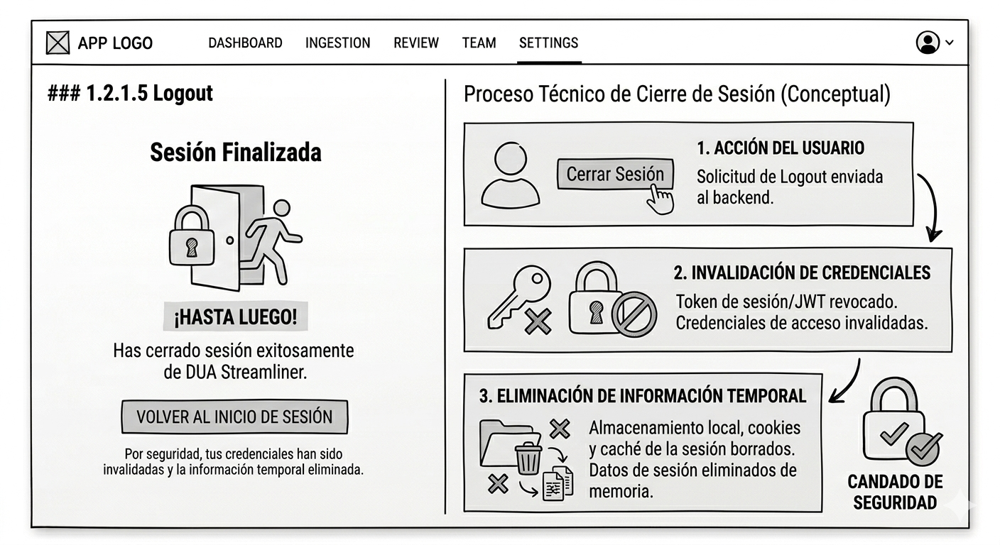

# DUA Streamliner — Frontend Design Specification

**Project:** DUA Streamliner  
**Problem Statement:** Automate the generation of the Documento Único Aduanero (DUA) in Costa Rica by extracting structured data from heterogeneous document sources (PDF, Excel, Images, Word) using AI and OCR pipelines, eliminating manual data entry and reducing error rates in customs declarations.  
**Authors:** Ben Farzamipour Alfaro - 2023121041 (Agent Role: Senior Software Architect)
**Version:** 1.0.0  
**Date:** 2026-03-04

---

# 1. Frontend Design

## 1.1 Technology Stack
Frontend technology, security, third-party libraries, frameworks, hosting; all with their respective versions.

- **Application type:** Single-Page Application (SPA)
- **Web framework:** React `18.3.1`
- **Web server:** Nginx `1.26.2`
- **Coding language:** TypeScript `5.4.5`
- **Unit testing framework:** Vitest `1.6.0` + React Testing Library `15.0.0`
- **Data validation framework:** Zod `3.23.8`
- **Code formatter:** Prettier `3.3.3`
- **Code style framework:** ESLint `9.5.0` + eslint-config-airbnb-typescript `18.0.0`
- **Integration testing tools:** Playwright `1.44.1`
- **Cloud service:** Amazon Web Services (AWS)
- **Hosted services within the cloud service:**
  - AWS S3 `— ` Static asset storage
  - AWS CloudFront `— ` CDN + edge caching
  - AWS Cognito `— ` Identity & access management
  - AWS WAF `— ` Web application firewall
- **Code repositories service:** GitHub
- **Code automation task tool:** Nx `19.3.0`
- **CI/CD pipelines technology:** GitHub Actions
- **Environments:** `development` · `staging` · `production`
- **Environment deployment tools:** AWS CDK `2.147.0`
- **Observability framework:** OpenTelemetry JS `0.51.1` + AWS CloudWatch + Sentry `8.9.2`

---

## 1.2 UX/UI Analysis
Includes the desired usability attributes, preliminary wireframe designs, UX process steps, and validation evidence from real user testing.

### 1.2.1 Core bussiness process.
Describe step by step what happens on each screen in terms of actions (nothing about buttons, nor interface elements, only user actions) and the result of each action.

### 1.2.1.1 Login
Action: The user provides their identity and confirms their access through a second authentication factor.
Result: The system validates the permissions associated with the role (agent, auditor or administrator) and establishes a secure and encrypted session.

### 1.2.1.2 Configure generator
Action: The user provides the source documentation (invoices, transport documents or Excel files) to the system.
Result: The system classifies the files and prepares the extraction engines (OCR/AI) to process the information according to the type of document.

### 1.2.1.3 Progress monitoring
Action: The user monitors the progress of the document processing and the status of the ingestion queue.
Result: The system reports in real time on the success of the extraction or if anomalies have been detected that require manual intervention.

### 1.2.1.4 Result obtention
Action: The user reviews the DUA fields generated automatically and corrects any discrepancies detected by the system.
Result: The system consolidates the validated information and prepares the document for submission to the customs authorities.

### 1.2.1.5 Logout
Action: The user logs out and closes the system.
Result: The system invalidates the access credentials and eliminates any temporary information associated with the session.

### 1.2.2 Wireframes
Title, description and image.

Login
- Login screen with fields for username and password, and login button.


Configure generator
- Generator configuration screen with fields to explore files, and cancel engine preparation.


Progress monitoring
- Progress monitoring screen with fields to view the progress of document processing and the status of the ingestion queue.


Result obtention
- Result obtention screen with fields to view the DUA fields generated automatically and correct any discrepancies detected by the system.


Logout
- Logout screen with fields to close the session.



### UX test results
For this UX test, Figma was used to simulate the user's actions and record the heatmaps (with Maze integration).

### Table with the test results

| Participant | State | Total Time | Screens Visited | Navigation Observation |
| --- | --- | --- | --- | --- |
| P1 | Completed | 46.2s | 6 | Linear and fast navigation. |
| P2 | Completed | 62.4s | 8 | Recurrent exploration between Monitoring and Results. |
| P3 | Completed | 93.5s | 11+ | Erratic path; returned several times to the start before completing. |
| Average | - | 67.4s | 8.3 | High exploration flow. |

### Evidence of the test execution

Clip of the test execution
<video src="./heatmaps%20UX%20Test/evidence_clip.mp4" controls width="100%">
  Your Markdown viewer does not support embedded video.
</video>

Start of the test for all users


End of the test for all users


### Heatmaps

Heatmap of the login page


Heatmap of the ingestion page


Heatmap of the dashboard page


Heatmap of the review page


Heatmap of the settings page


## 1.3 Component Design Strategy
Define the design techniques and principles for frontend components, how component reuse is achieved, how styles, branding, internationalization, and responsiveness are centralized.

### Methodology: Atomic Design

Components are organized using the Atomic Design taxonomy:

| Level | Description | Examples |
|---|---|---|
| **Atoms** | Single-purpose, stateless primitives | `Button`, `Badge`, `Input`, `Tooltip`, `Icon` |
| **Molecules** | Composed atoms with local state | `FormField`, `ConfidenceBadge`, `FileCard`, `SearchBar` |
| **Organisms** | Feature-complete sections | `DocumentUploader`, `DUAFormSection`, `ExtractionReviewPanel` |
| **Templates** | Layout shells, no business logic | `TwoColumnLayout`, `DashboardShell`, `AuthLayout` |
| **Pages** | Route-bound, data-connected | `IngestionPage`, `ReviewPage`, `DUAEditorPage`, `DashboardPage` |

### Reusability Principles

- All atoms and molecules are **headless-first**: behavior is decoupled from presentation via `shadcn/ui` primitives.
- Compound components use the **Compound Component Pattern** (context + sub-components) for complex UI like the `DUAForm`.
- Shared hooks in `/src/hooks/` encapsulate all reusable side-effect logic.

### Design Tokens (Centralized Styling)

Defined in `/src/styles/tokens.css` as CSS custom properties, consumed by Tailwind via `tailwind.config.ts`:

```css
/* /src/styles/tokens.css */
:root {
  /* Confidence Semaphore */
  --color-confidence-high:   #22c55e;
  --color-confidence-medium: #eab308;
  --color-confidence-low:    #ef4444;

  /* Brand */
  --color-brand-primary:   #1d4ed8;
  --color-brand-secondary: #0f172a;

  /* Surfaces */
  --color-surface-base:    #ffffff;
  --color-surface-raised:  #f8fafc;
  --color-surface-overlay: #1e293b;

  /* Typography */
  --font-family-sans: 'Inter', system-ui, sans-serif;
  --font-size-base:   1rem;

  /* Spacing scale */
  --space-1: 0.25rem;
  --space-2: 0.5rem;
  --space-4: 1rem;
  --space-8: 2rem;
}
```

### Internationalization (i18n)

- Provider: `i18next` with `react-i18next` bindings.
- Locale files: `/src/locales/{es,en}/` — namespace-per-feature (e.g., `dua.json`, `common.json`, `errors.json`).
- Lazy-loaded namespaces via `i18next-http-backend` to avoid bundling all translations upfront.
- Date/number formatting delegated to `Intl` API; currency formatting uses `Intl.NumberFormat` with `CRC`/`USD` locale awareness.
- Default locale: `es-CR`. Fallback: `en`.

### Responsiveness Strategy

| Breakpoint | Target | Layout Strategy |
|---|---|---|
| `sm` (640px) | Mobile — tablet | Single-column, stacked panels |
| `md` (768px) | Tablet landscape | Two-column with collapsible sidebar |
| `lg` (1024px) | Desktop | Full split-view (document + form) |
| `xl` (1280px+) | Wide desktop | Three-column with audit panel |

CSS container queries (`@container`) used for organism-level responsiveness independent of viewport width.

---

## 1.4 Security
Technologies, techniques and classes with their respective location in the project structure responsible for authentication and authorization of permissions and sessions.

### Authentication

| Concern | Technology | Location |
|---|---|---|
| Identity Provider | Auth0 (PKCE + OIDC) | `/src/auth/AuthProvider.tsx` |
| Token Storage | In-memory only (no localStorage) | `/src/auth/tokenStore.ts` |
| Silent Refresh | Auth0 SDK `useAuth0().getAccessTokenSilently()` | `/src/auth/useAuthToken.ts` |
| Protected Routes | `<RequireAuth>` HOC | `/src/router/ProtectedRoute.tsx` |

### Authorization

| Concern | Technology | Location |
|---|---|---|
| RBAC Roles | Auth0 custom claims (`permissions[]`) | Decoded in `/src/auth/usePermissions.ts` |
| Permission Guards | `<Can action="dua:submit" subject="DUA">` | `/src/auth/Can.tsx` (CASL integration) |
| UI-level gating | `usePermissions()` hook | Consumed in organisms and pages |

### Session Management

| Concern | Mechanism | Location |
|---|---|---|
| Session expiry | Auth0 idle timeout + refresh token rotation | `/src/auth/AuthProvider.tsx` |
| Logout | Full redirect logout, clears IDP cookie | `/src/auth/useLogout.ts` |
| CSRF protection | SameSite=Strict cookies on API layer | Backend-enforced; Axios sends no cookies |
| API request signing | Bearer token injected via Axios interceptor | `/src/services/http/authInterceptor.ts` |

---

## 1.5 Layered Design
Design and explanation of the various layers of the application on the frontend.

```
┌─────────────────────────────────────────────────────┐
│                  Presentation Layer                  │
│  /src/pages, /src/components/{organisms,templates}  │
│  React components, route definitions, UI state      │
├─────────────────────────────────────────────────────┤
│                 Application Layer                    │
│  /src/hooks, /src/store, /src/features/*            │
│  Use-case orchestration, TanStack Query mutations,  │
│  Zustand slice reducers, form submission workflows  │
├─────────────────────────────────────────────────────┤
│                   Service Layer                      │
│  /src/services                                      │
│  Axios instances, API adapters, Auth0 token mgmt,  │
│  WebSocket client, file upload multipart handlers   │
├─────────────────────────────────────────────────────┤
│                   Domain Layer                       │
│  /src/domain                                        │
│  TypeScript interfaces/types, Zod schemas,          │
│  business rule validators, value objects (DUA, Doc) │
└─────────────────────────────────────────────────────┘
```

| Layer | Dependency Rule | Key Constraint |
|---|---|---|
| Presentation | → Application | No direct service/domain imports |
| Application | → Service, Domain | No React rendering logic |
| Service | → Domain | No UI state, no Zustand |
| Domain | (none) | Pure TypeScript; zero framework imports |

---

## 1.6 Design Patterns
Design of classes with their respective location in the project structure, where it is necessary to apply object-oriented design patterns, such as: security, UI refresh, notification reception, state storage, API calls, asynchronous operations, session invalidation, event-driven programming, object creation.

| Pattern | Intent | Location in `/src` |
|---|---|---|
| **Observer** | React to extraction events pushed via WebSocket | `/src/services/ws/ExtractionEventBus.ts` |
| **Factory** | Instantiate document parsers based on MIME type | `/src/domain/factories/DocumentParserFactory.ts` |
| **Repository** | Abstract API data access behind a consistent interface | `/src/services/repositories/DUARepository.ts`, `DocumentRepository.ts` |
| **Strategy** | Swap confidence-scoring algorithms without consumer changes | `/src/domain/strategies/ConfidenceStrategy.ts` |
| **Proxy** | Intercept HTTP requests for auth token injection and logging | `/src/services/http/authInterceptor.ts`, `loggingInterceptor.ts` |
| **Compound Component** | Expose flexible composition API for complex form sections | `/src/components/organisms/DUAForm/` (Context + sub-components) |
| **Command** | Encapsulate user actions (submit, revert, bulk-approve) | `/src/features/dua/commands/` |
| **Facade** | Single entry point for AI extraction service calls | `/src/services/ExtractionFacade.ts` |
| **Adapter** | Normalize heterogeneous API response shapes to domain types | `/src/services/adapters/ExtractionAdapter.ts`, `DUAAdapter.ts` |
| **Singleton** | Single Axios instance and i18n instance across the app | `/src/services/http/httpClient.ts`, `/src/i18n/index.ts` |

---

## 1.7 Scaffold
A folder in /src that contains the project scaffold, which is generated from the entire specification of points 1.1 to 1.6.

```
/src
├── assets/
│   ├── fonts/
│   └── images/
│
├── auth/
│   ├── AuthProvider.tsx          # Auth0 provider wrapper
│   ├── Can.tsx                   # CASL permission guard component
│   ├── tokenStore.ts             # In-memory token store
│   ├── useAuthToken.ts           # Hook: getAccessTokenSilently
│   ├── useLogout.ts              # Hook: full redirect logout
│   └── usePermissions.ts         # Hook: decode Auth0 custom claims
│
├── components/
│   ├── atoms/
│   │   ├── Badge/
│   │   ├── Button/
│   │   ├── Icon/
│   │   ├── Input/
│   │   ├── Spinner/
│   │   └── Tooltip/
│   ├── molecules/
│   │   ├── ConfidenceBadge/      # Semaphore visual indicator
│   │   ├── FileCard/
│   │   ├── FormField/
│   │   └── SearchBar/
│   ├── organisms/
│   │   ├── DocumentUploader/     # Drag-and-drop + progress
│   │   ├── DUAForm/              # Compound component
│   │   │   ├── DUAFormContext.ts
│   │   │   ├── DUAFormRoot.tsx
│   │   │   ├── DeclarantSection.tsx
│   │   │   ├── GoodsSection.tsx
│   │   │   ├── ValuationSection.tsx
│   │   │   └── CustomsRegimeSection.tsx
│   │   ├── ExtractionReviewPanel/
│   │   ├── AuditLogTable/
│   │   └── NavigationSidebar/
│   └── templates/
│       ├── AuthLayout.tsx
│       ├── DashboardShell.tsx
│       └── TwoColumnLayout.tsx
│
├── domain/
│   ├── entities/
│   │   ├── DUA.ts                # Core DUA value object
│   │   └── Document.ts           # Ingested document entity
│   ├── factories/
│   │   └── DocumentParserFactory.ts
│   ├── schemas/                  # Zod schemas
│   │   ├── dua.schema.ts
│   │   └── document.schema.ts
│   ├── strategies/
│   │   └── ConfidenceStrategy.ts
│   └── types/
│       ├── api.types.ts
│       ├── dua.types.ts
│       └── extraction.types.ts
│
├── features/
│   ├── dashboard/
│   │   ├── hooks/
│   │   └── components/
│   ├── dua/
│   │   ├── commands/             # Command pattern actions
│   │   │   ├── SubmitDUACommand.ts
│   │   │   ├── RevertFieldCommand.ts
│   │   │   └── BulkApproveCommand.ts
│   │   ├── hooks/
│   │   │   ├── useDUAEditor.ts
│   │   │   └── useFieldValidation.ts
│   │   └── store/
│   │       └── duaSlice.ts
│   └── ingestion/
│       ├── hooks/
│       │   └── useDocumentUpload.ts
│       └── store/
│           └── ingestionSlice.ts
│
├── hooks/                        # Shared application hooks
│   ├── useDebounce.ts
│   ├── useMediaQuery.ts
│   └── useToast.ts
│
├── i18n/
│   ├── index.ts                  # i18next singleton init
│   └── locales/
│       ├── en/
│       │   ├── common.json
│       │   ├── dua.json
│       │   └── errors.json
│       └── es/
│           ├── common.json
│           ├── dua.json
│           └── errors.json
│
├── pages/
│   ├── DashboardPage.tsx
│   ├── DUAEditorPage.tsx
│   ├── IngestionPage.tsx
│   ├── LoginPage.tsx
│   ├── ReviewPage.tsx
│   └── AdminPage.tsx
│
├── router/
│   ├── index.tsx                 # Route definitions, lazy loading
│   └── ProtectedRoute.tsx        # RequireAuth HOC
│
├── services/
│   ├── adapters/
│   │   ├── DUAAdapter.ts
│   │   └── ExtractionAdapter.ts
│   ├── http/
│   │   ├── httpClient.ts         # Axios singleton
│   │   ├── authInterceptor.ts    # Proxy: token injection
│   │   └── loggingInterceptor.ts # Proxy: observability
│   ├── repositories/
│   │   ├── DUARepository.ts
│   │   └── DocumentRepository.ts
│   ├── ws/
│   │   └── ExtractionEventBus.ts # Observer: WebSocket events
│   └── ExtractionFacade.ts       # Facade: AI extraction calls
│
├── store/
│   └── index.ts                  # Zustand root store composition
│
├── styles/
│   ├── tokens.css                # Design tokens (CSS custom props)
│   ├── globals.css               # Base reset + Tailwind directives
│   └── animations.css            # Keyframes and transitions
│
├── utils/
│   ├── formatters.ts             # Date, currency, number formatting
│   ├── confidence.ts             # Semaphore score → color mapping
│   └── errorHandler.ts           # Global error normalization
│
├── App.tsx
├── main.tsx
└── vite-env.d.ts
```

# 2. Backend Design

# 3. Data Design